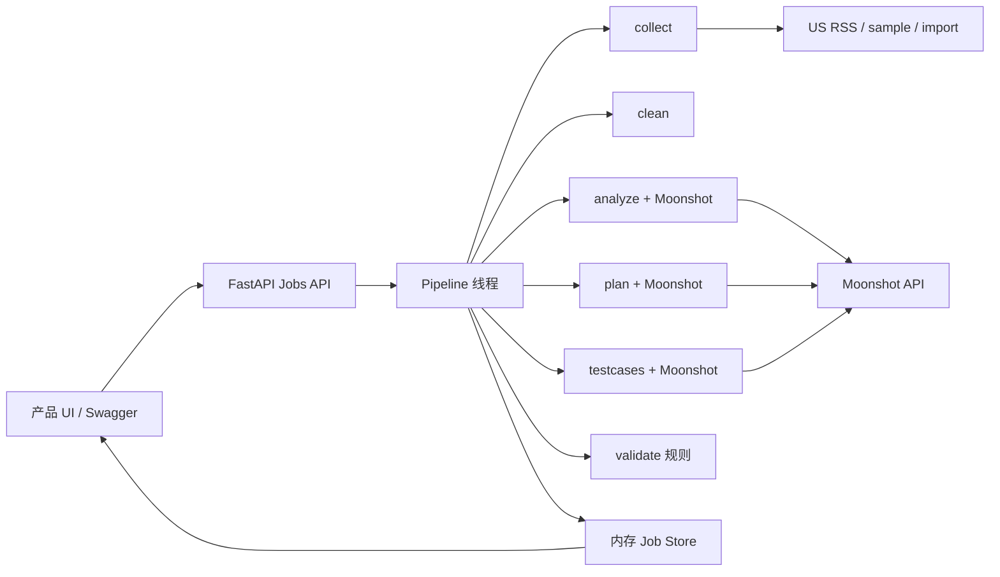
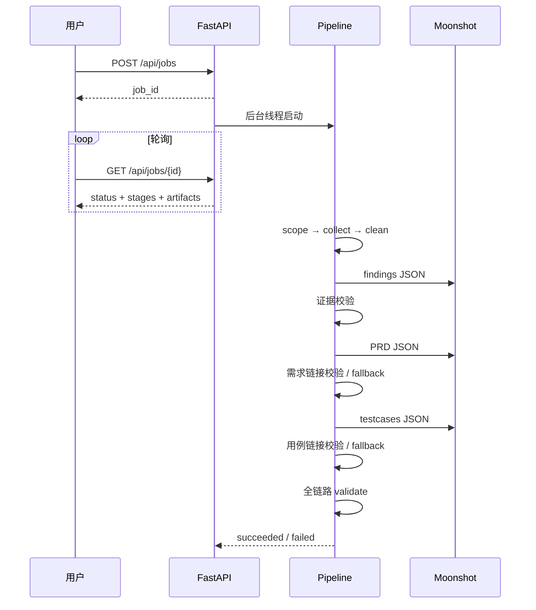

# App Review Planner — 项目产出文档

> 仓库：https://github.com/twostop0-jpg/app-review-planner  
> 对应作业：LaienTech iOS App Review Analysis and Version Planning Assessment  
> 本文档覆盖：需求拆解 → 技术方案 → 数据与接口 → 核心实现与自测

---

## 0. 项目目标与最终结果（总览）

### 目标
构建可本地运行的分析工具：用户输入**美区 App Store 链接**与可选**分析目标**，系统自动完成评论采集、清洗、问题发现、PRD/版本规划、测试用例生成与全链路追溯校验，并通过 UI 展示进度与结果。

### 最终交付
| 交付物 | 位置 |
|--------|------|
| 可运行源码 | GitHub 仓库全文 |
| 产品 UI | `http://127.0.0.1:8001/`（FastAPI 托管，无需 Node） |
| API 文档 | `http://127.0.0.1:8001/docs` |
| 设计说明 | `docs/` 目录 |
| 离线样例数据 | `data/samples/`、`data/imports/` |

### 技术栈
- 后端：Python + FastAPI
- 产品 UI：FastAPI 静态页面（`backend/app/web/`）
- 可选前端：React + Vite（`frontend/`）
- 大模型：Moonshot（OpenAI 兼容 Chat Completions）

---

## 1. 需求拆解

### 1.1 功能点清单

| ID | 功能点 | 输入 | 输出 | 验收标准 |
|----|--------|------|------|----------|
| F1 | 分析范围设定 | App URL、goal、source | `artifacts.scope` | 正确解析 app_id；记录 focus/source/storefront=us |
| F2 | 评论采集 | live / sample / import | `reviews_raw`、`collection_meta` | 美区数据或明确标注的缓存/导入；不伪造评论 |
| F3 | 评论清洗 | raw reviews | `reviews_cleaned`、`cleaning_report` | 规范化、去重、可统计；本阶段不调用 LLM |
| F4 | 动态 Findings | cleaned reviews + goal | `findings`、`analysis_stats` | 非固定关键词表；每条含证据 review ID；无效证据剔除 |
| F5 | PRD / 版本规划 | findings + goal | `prd`（含 requirements、version_plan） | 需求挂 finding/review；有 P0/P1/P2 与版本拆分 |
| F6 | 测试用例生成 | PRD requirements | `testcases` | 用例挂 req_id 与 review_id；可验证需求 |
| F7 | 追溯校验 | reviews/findings/prd/testcases | `validation` | 校验评论→发现→需求→用例；`ok` 或列出 issues |
| F8 | 任务编排与进度 | 创建 Job | stages 状态机 | UI/API 可轮询；失败时标记 error stage |
| F9 | 产品 UI | 用户表单操作 | 结构化结果展示 | 可选 sample/live/import；展示 findings/PRD/用例/追溯 |
| F10 | 导入兼容 | JSON/CSV | 进入同一流水线 | 文档化字段；未见过数据可跑通 |

### 1.2 约束与非目标
- **必须**：美区评论；不硬编码某 App 的结论分类；密钥不入库
- **非目标**：不做真实 App 发版；不替代人工最终决策；不保证抓取全量历史评论

### 1.3 验收总标准（对应作业）
1. 可本地运行，UI 能 Start 并看到阶段进度与结果  
2. 至少一处核心语义任务由模型驱动（本项目：analyze / plan / testcases）  
3. Findings/需求/用例可追溯到评论  
4. 支持 live、sample、import  
5. 有采集说明、样本数据、运行说明、AI 披露  

---

## 2. 技术方案草图

### 2.1 总体架构



### 2.2 关键流程（Job Pipeline）



### 2.3 关键设计取舍

| 阶段 | 方法 | 原因 |
|------|------|------|
| collect / clean / validate | 规则 / 统计 | 确定性、可复现、防幻觉 |
| analyze / plan / testcases | Moonshot + 后端校验 | 需要语义归纳与生成；后端过滤非法 ID |
| JSON 失败 / 429 | 重试 + 规则 fallback | 保证演示可完成且仍可追溯 |
| 模型阶段间隔 ~22s | 限流保护 | 适配低 RPM |

### 2.4 目录结构（关键）

```text
backend/app/
  api/routes.py          # HTTP 接口
  models/schemas.py      # 数据结构
  services/pipeline.py   # 流水线编排
  services/collect.py    # 采集
  services/clean.py      # 清洗
  services/analyze.py    # Findings
  services/plan.py       # PRD
  services/testcases.py  # 测试用例
  services/validate.py   # 追溯
  services/moonshot_client.py
  prompts/               # 提示词
  web/                   # Python 产品 UI
docs/                    # 设计文档
data/samples|imports/    # 样例与导入示例
```

---

## 3. 数据与接口定义

### 3.1 核心数据结构

#### Review（评论）
| 字段 | 类型 | 说明 |
|------|------|------|
| id | string | 评论 ID |
| app_id | string | App ID |
| rating | int? | 1–5 |
| title / content / author | string | 文本 |
| date / version | string? | 日期、版本 |
| country | string | 固定美区 `us` |
| source | live\|sample\|import | 来源 |

#### Finding（问题发现）
| 字段 | 类型 | 说明 |
|------|------|------|
| finding_id | string | 如 f1 |
| title / summary | string | 标题与摘要 |
| severity | high\|medium\|low | 严重度 |
| evidence_review_ids | string[] | 证据评论 |
| evidence_excerpts | string[] | 摘录 |
| support_count / confidence | number | 支持数/置信度 |
| assumption | bool | 是否弱证据假设 |
| origin | model\|stat\|rule | 结论来源 |

#### Requirement（PRD 需求）
| 字段 | 类型 | 说明 |
|------|------|------|
| req_id | string | 如 R1 |
| priority | P0\|P1\|P2 | 优先级 |
| version | vNext-1\|vNext-2\|Research | 版本桶 |
| linked_finding_ids | string[] | 关联发现 |
| linked_review_ids | string[] | 关联评论 |
| acceptance_criteria | string[] | 验收标准 |

#### TestCase（测试用例）
| 字段 | 类型 | 说明 |
|------|------|------|
| tc_id | string | 如 TC1 |
| steps / expected_result | list/string | 步骤与期望 |
| linked_req_ids | string[] | 关联需求 |
| linked_review_ids | string[] | 关联评论 |
| origin | model\|rule | 生成来源 |

#### Job 状态
`queued → running → succeeded|failed`；stages：`pending|running|done|error|skipped`。

### 3.2 主要 HTTP 接口

| 方法 | 路径 | 说明 |
|------|------|------|
| GET | `/` | 产品 UI |
| GET | `/health` | 健康检查 |
| POST | `/api/jobs` | 创建分析任务 |
| GET | `/api/jobs/{job_id}` | 查询进度与 artifacts |
| POST | `/api/collect/preview` | 仅预览采集 |
| POST | `/api/clean/preview` | 仅预览清洗 |

#### POST /api/jobs 请求体
```json
{
  "app_url": "https://apps.apple.com/us/app/workout-for-women-home-gym/id839285684",
  "goal": "improve retention and billing clarity",
  "source": "sample",
  "import_path": null,
  "max_pages": 5
}
```

#### POST /api/jobs 响应
```json
{ "job_id": "uuid" }
```

#### GET /api/jobs/{job_id} 关键关键（成功时）
- `status`: `succeeded`
- `stages[]`: 七阶段状态与 message
- `artifacts.findings` / `prd` / `testcases` / `validation`
- `error`: null

### 3.3 追溯链定义
```text
Review.id
  → Finding.evidence_review_ids
    → Requirement.linked_finding_ids + linked_review_ids
      → TestCase.linked_req_ids + linked_review_ids
```
`validate` 阶段确定性检查上述链接与需求覆盖。

---

## 4. 核心功能实现与自测记录

### 4.1 核心实现说明

#### （1）采集 `collect.py`
- 优先 US iTunes Customer Reviews **RSS XML**
- 空结果时回退 MZStore 评论文档接口
- `sample` 读缓存；`import` 读 JSON/CSV
- 限制翻页与请求间隔，避免压测目标站

#### （2）清洗 `clean.py`
- 空白/HTML 规范化、低信号过滤、id/内容去重
- 产出 `cleaning_report`（输入输出量、重复数、评分分布）

#### （3）Findings `analyze.py` + `prompts/findings.py`
- 先算确定性 stats（直方图、低分率等）
- Moonshot 生成 JSON findings
- 后端校验：证据 ID 必须存在于 cleaned reviews；否则拒绝

#### （4）PRD `plan.py` + `prompts/prd.py`
- 由 findings 生成版本化需求
- 校验 finding/review 链接；失败则规则 fallback（仍挂证据）

#### （5）测试用例 `testcases.py` + `prompts/testcases.py`
- 按需求生成步骤与期望
- 校验 req/review 链接；429/坏 JSON 时 fallback

#### （6）追溯 `validate.py`
- 确定性检查全链路与覆盖缺口
- 产出 `validation.ok / issues / revisions / summary`

#### （7）UI `backend/app/web/`
- 中文产品页；创建 Job 并轮询；结构化展示结果

### 4.2 关键代码位置（便于审阅）

| 能力 | 文件 |
|------|------|
| 流水线编排 | `backend/app/services/pipeline.py` |
| 任务 API | `backend/app/api/routes.py` |
| 数据结构 | `backend/app/models/schemas.py` |
| Moonshot 客户端 | `backend/app/services/moonshot_client.py` |
| 提示词 | `backend/app/prompts/*.py` |
| 产品 UI | `backend/app/web/index.html` |

### 4.3 关键代码片段（示意）

**流水线阶段定义：**
```python
STAGE_DEFS = [
    ("scope", "Determine analysis scope"),
    ("collect", "Collect reviews"),
    ("clean", "Clean and structure reviews"),
    ("analyze", "Classify and analyze"),
    ("plan", "Create PRD and version plan"),
    ("testcases", "Generate test cases"),
    ("validate", "Validate traceability"),
]
```

**创建任务接口：**
```python
@router.post("/api/jobs", response_model=JobCreateResponse)
def create_job(req: AnalyzeRequest) -> JobCreateResponse:
    job_id = create_and_start_job(req)
    return JobCreateResponse(job_id=job_id)
```

### 4.4 自测记录

| 编号 | 场景 | 步骤 | 结果 | 备注 |
|------|------|------|------|------|
| T1 | sample 全链路 | UI/`POST /api/jobs`，source=sample | `succeeded`；findings/prd/testcases 非空；`validation.ok=true` | 主演示路径 |
| T2 | Day5 PRD | 同上，检查 plan 非 placeholder | 产出 3 条 requirements，含链接 | 已通过 |
| T3 | Day6 追溯 | 检查 validate message | `Traceability OK` | 已通过 |
| T4 | 模型 JSON 损坏 | plan 阶段非法 JSON | 规则 fallback，任务仍可成功 | 已验证 |
| T5 | Moonshot 429 | testcases 限流 | `[fallback]` + 规则用例，追溯仍 OK | job `5747a5c8-...` |
| T6 | Python UI | 打开 `/`，中文界面 Start | 可轮询并展示分区结果 | 无需 Node |
| T7 | 导入 CSV | source=import，`data/imports/example_reviews.csv` | 可进入流水线 | 格式见 docs |
| T8 | 密钥缺失 | 无 `MOONSHOT_API_KEY` | analyze/plan 明确报错 | 预期行为 |

### 4.5 已知限制
- 公共 RSS 非全量历史评论
- live 受网络与接口波动影响
- Moonshot 低 RPM 时可能 fallback（结果仍可追溯）
- 模型生成文本语言受评论/目标语言影响（评论为英文时结论常为英文）

---

## 5. 运行与提交信息

### 运行
```bat
cd backend
copy .env.example .env
REM 编辑 .env 填入 MOONSHOT_API_KEY
python -m venv .venv
.\.venv\Scripts\activate.bat
pip install -r requirements.txt
uvicorn app.main:app --reload --port 8001
```
打开：http://127.0.0.1:8001/

### 提交链接
- 代码仓库：https://github.com/twostop0-jpg/app-review-planner  
- 本产出文档：仓库内 `docs/project-delivery.md`

### AI 辅助说明
开发过程使用 Cursor 辅助编码；运行时语义分析由应用内 Moonshot 提示词与证据校验完成。详见 README 披露段落。
